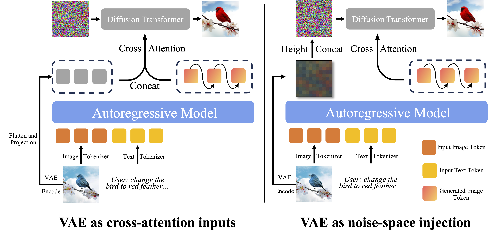

# BLIP3o-NEXT-edit

</tiny><a href="https://jiuhaichen.github.io/BLIP3o-NEXT.github.io/" style="font-weight: normal;">Project Page</a></tiny>


<p align="center">

</p>


 **Fully Open-Source:**
  - **Image Editing Data:** [TODO]()
  - **Model Weights (3B):** [BLIP3o-NEXT-edit-VAE-Condition](https://huggingface.co/BLIP3o/BLIP3o-NEXT-edit-VAE)


🔥 Welcome to discuss with us if you have any questions.
Discord: https://discord.gg/SsVYdV84bw
or Wechat
<p align="center">

</p>


Install package for image editing training
```Shell
conda create -n blip3o-next python=3.11 -y
conda activate blip3o-next
pip install --upgrade pip  setuptools
pip install -r requirements.txt
pip install -e .
```


Import slurm config and environment
```Shell
TODO
```

For the inference, change the model path in inference.py and

```Shell
bash inference.sh
```

