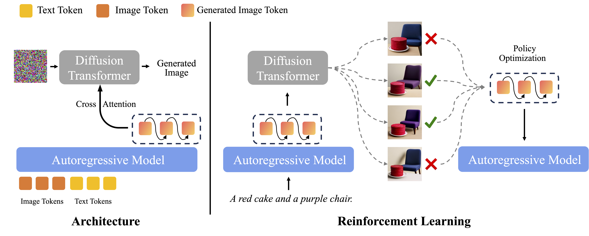

# BLIP3o-NEXT 

<!-- </tiny><a href="https://jiuhaichen.github.io/BLIP3o-NEXT.github.io/" style="font-weight: normal;">Project Page</a></tiny> -->


## 📖 [Arxiv](http://arxiv.org/abs/2510.15857)


<p align="center">

</p>


**AR + Diffusion Architecture**: Similar with BLIP3o, BLIP3o-NEXT generates intermediate features via the autoregressive model and then conditions on these features to generate images through the diffusion model.

**Discrete Image Token Supervision**: We add discrete SigLIP-2 image token prediction as extra training supervision, jointly optimizing CrossEntropy and the diffusion objective. By having the AR model lay down a discrete "blueprint" and feeding their hidden representations into the diffusion model, we combine structural accuracy with high visual-fidelity image outputs.

**RL with verified reward**: The introduction of discrete image tokens unlocks seamless compatibility with existing language-model RL framework. Using Group Relative Policy Optimization (GRPO), we train the BLIP3o-NEXT to improve prompt alignment and text rendering in image generation.


 **Fully Open-Source:**
  - **Pretraining Data:** [27 Million Detailed Captions](https://huggingface.co/datasets/BLIP3o/BLIP3o-Pretrain-Long-Caption), [5 Million Short Captions](https://huggingface.co/datasets/BLIP3o/BLIP3o-Pretrain-Short-Caption)
  - **Instruction Tuning Data:** [BLIP3o-60k](https://huggingface.co/datasets/BLIP3o/BLIP3o-60k), [ShareGPT-4o-Image](https://huggingface.co/datasets/FreedomIntelligence/ShareGPT-4o-Image)
- **Image Editing Data:** [BLIP3o-edit (TODO)]
- **Model Weights (3B):** [Pretrain](https://huggingface.co/BLIP3o/BLIP3o-NEXT-Pretrain), [Instruction Tuning](https://huggingface.co/BLIP3o/BLIP3o-NEXT-SFT), [GRPO-Geneval](https://huggingface.co/BLIP3o/BLIP3o-NEXT-GRPO-Geneval), [GRPO-Text]()
- **Training Code:** Pretrain, Instruction Tuning, GRPO


🔥 Welcome to discuss with us if you have any questions.
Discord: https://discord.gg/SsVYdV84bw
or Wechat
<p align="center">

</p>


Install package for pretraining and instruction tuning
```Shell
conda create -n blip3o-next python=3.11 -y
conda activate blip3o-next
pip install --upgrade pip  setuptools
pip install -r requirements.txt
pip install -e .
```


Import slurm config and environment
```Shell
sbatch  scrips/run.sh
```

For the inference, change the model path in inference.py and

```Shell
python inference.py
```

For GRPO, we recommend to install a new enviroment since some version conflicts for torch if using blip3o-next environment. Also you need to install the dependency from  [setup.py](https://github.com/JiuhaiChen/BLIP3o/blob/BLIP3o-NEXT/setup.py), please follow below


```Shell
cd trl
conda create -n grpo python=3.11 -y
conda activate grpo
pip install -r requirements.txt
cd ..
pip install -e .
```

